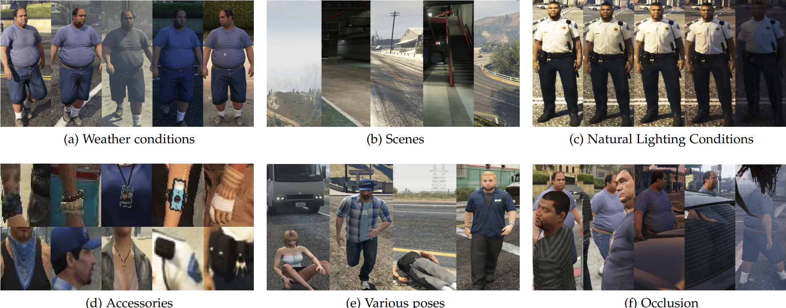

# WePerson
This repository contains the WePerson dataset proposed in our paper "[WePerson: Learning a Generalized Re-identification Model from All-weather Virtual Data](https://dl.acm.org/doi/10.1145/3474085.3475455)".

<!-- <p align="center"></p> -->
<!-- <p align="center">Fig. 1. Sample images from the proposed WePerson dataset.</p>  -->

<p align="center">Fig. 1. Sample images from the proposed WePerson dataset.</p>

##TODO List

- [ ]SQA Code Release

## Table of Contents
- [Dataset Description](#dataset-description)
- [Experiment results](#experiment-results)
- [Citation](#citation)
- [Contacts](#contacts)

## Dataset Description

The WePerson dataset is generated by [GTA V](https://www.rockstargames.com/gta-v) with [Script Hook V](http://www.dev-c.com/gtav/scripthookv/) and [scripthookvdotnet](https://github.com/crosire/scripthookvdotnet). This is the largest synthetic person re-identification dataset that includes 4,000,000 images from 1,500 identities. Images in the dataset are collected with **40 viewpoints per scene, various poses, complex backgrounds, occlusions, 7 different types of weather, 7 different types of natural illuminations**. Identities in the dataset not only have different clothes but also **wearable accessories**, such as sunglasses, hats, etc. We show some dataset properties in Fig. 2.


<p align="center">Fig. 2. Properties of the proposed WePerson dataset.</p> 

### Download Link
Due to the large amount of data, currently only a subset of WePerson is provided in Baidu Pan. 

The subset can be downloaded from the link:
[BaiDu Pan](https://pan.baidu.com/s/1JjiELlbMqHRFacvkMAf0lg?pwd=s4w6)

### File Structure  
```
WePerson Dataset
├── WePerson/
|   ├── 0000/
|   |   ├── 0000_c00_s00_T04.png
|   |   ├── 0000_c00_s00_T12.png
|   |   ├── 0000_c01_s03_T20.png
|   |   └── ...
|   ├── 0001/
|   |   ├── 0001_c03_s10_T10.png
|   |   ├── 0001_c06_s07_T20.png
|   |   ├── 0001_c10_s03_T4.png
|   |   └── ...
|   └── ...
```

The filenames are encoded as follows. Take "0000_c00_s00_T04.png" as an example,
* 0000 is the id of the person
* c00 is the id of the camera
* s00 is the id of the scene
* T04 is the current time that is related to natural illumination. 

## Experiment Results
By training person re-identification models on our dataset, we demonstrate that the model trained on virtual data outperforms the model trained on real-world dataset. Our dataset also surpasses other synthetic dataset in direct transfer. 

In direct transfer evaluation, we achieve:


## Citation
```
@inproceedings{li2021weperson,
  title={WePerson: Learning a Generalized Re-identification Model from All-weather Virtual Data},
  author={Li, He and Ye, Mang and Du, Bo},
  booktitle={29th ACM International Conference on Multimedia (ACMMM)},
  year={2021}
}
```

## Contacts
He Li

School of Computer Science, Wuhan University

lihe404@whu.edu.cn
